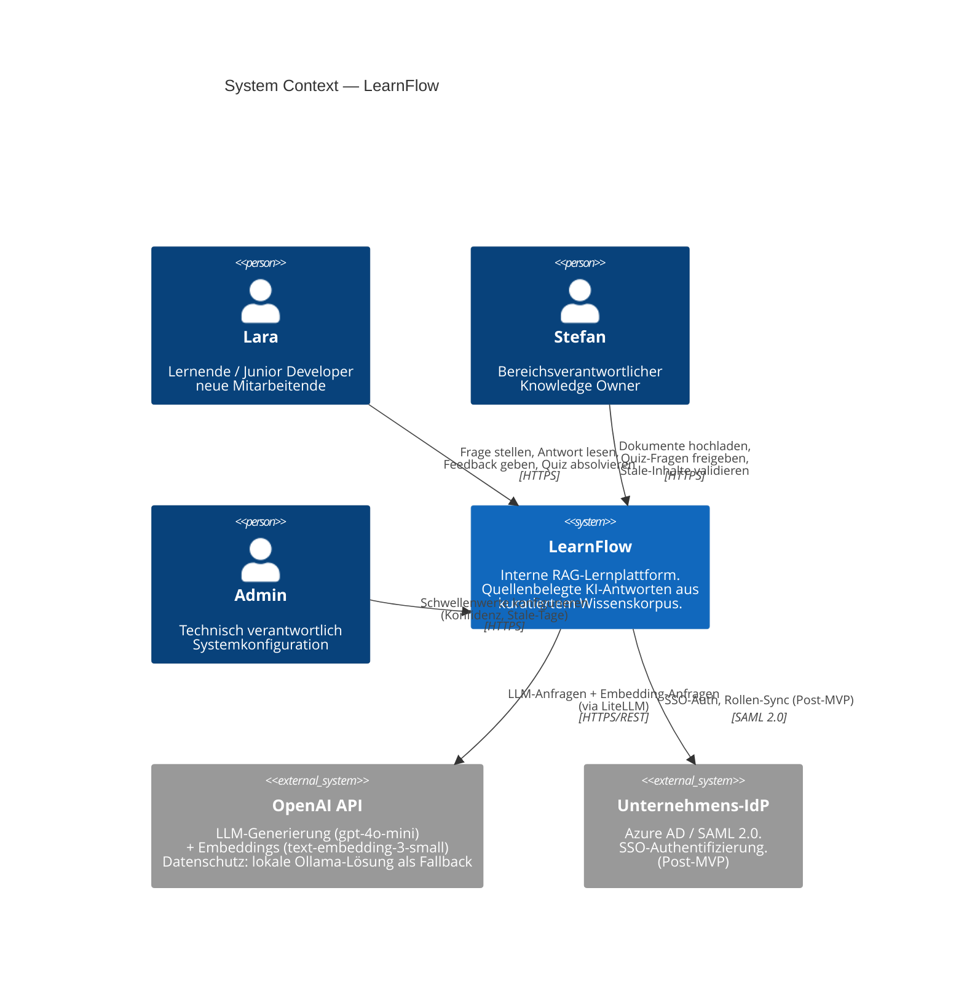

# C4 — Level 1: System Context Diagram
## LearnFlow · Interne RAG-Lernplattform

*BFH CAS ADAI 2026 · Modul 3 Tag 1 · Übung 3*

---

## Diagramm (Text)

```
╔══════════════════════════════════════════════════════════════════════════════╗
║                        SYSTEMKONTEXT — LearnFlow                            ║
╚══════════════════════════════════════════════════════════════════════════════╝

  [Lara]                    [Stefan]                    [Admin]
  Lernende                  Bereichs-                   Technisch
  Junior Developer          verantwortlicher            verantwortlich
  neue Mitarbeitende        Knowledge Owner
       │                         │                           │
       │ Frage stellen           │ Dokumente hochladen       │ Schwellenwerte
       │ Antwort lesen           │ Korpus verwalten          │ konfigurieren
       │ Feedback geben          │ Quiz-Fragen freigeben     │ (Konfidenz,
       │ Quiz absolvieren        │ Stale-Inhalte validieren  │  Stale-Tage)
       │                         │                           │
       ▼                         ▼                           ▼
┌─────────────────────────────────────────────────────────────────────────────┐
│                                                                             │
│                            L e a r n F l o w                               │
│                                                                             │
│   Interne RAG-Lernplattform · quellenbelegte KI-Antworten                 │
│   aus kuratiertem Wissenskorpus · ein Pilot-Bereich · Web-App              │
│                                                                             │
└─────────────────────────────────────────────────────────────────────────────┘
            │                                          │
            │ LLM-Generierung +                        │ SSO-Authentifizierung
            │ Embedding-Anfragen                       │ Rollen-Synchronisation
            │ (via LiteLLM)                            │ (Post-MVP)
            │                                          │
            ▼                                          ▼
  [OpenAI API]                          [Unternehmens-IdP]
  gpt-4o-mini (LLM)                          Azure AD / SAML 2.0
  text-embedding-3-small                      Post-MVP
  EU-Datenhaltung (DSGVO)
```

---

## Diagramm (Mermaid — für Rendering in GitHub/Obsidian)



---

## Interaktions-Übersicht

| Von | Nach | Interaktion | Protokoll |
|---|---|---|---|
| Lara | LearnFlow | Frage stellen, Antwort lesen, Feedback geben, Quiz absolvieren | HTTPS |
| Stefan | LearnFlow | Dokumente hochladen, Korpus verwalten, Quiz freigeben, Stale-Inhalte validieren | HTTPS |
| Admin | LearnFlow | Konfidenz- und Stale-Schwellenwerte konfigurieren | HTTPS |
| LearnFlow | OpenAI API | LLM-Generierung + Embedding-Anfragen via LiteLLM | HTTPS/REST |
| LearnFlow | Unternehmens-IdP | SSO-Authentifizierung + Rollen-Synchronisation *(Post-MVP)* | SAML 2.0 |

---

## Was haben wir vergessen?

### 1. Kein Monitoring / Alerting-System
Die Reliability-NFA (Halluzinationsrate messbar, Out-of-Corpus-Rate trackbar) braucht Observability. Kein externer Service dafür definiert. Für einen Piloten mit < 30 Nutzern reicht strukturiertes Logging ins Container-Log — aber es fehlt im Systemkontext als explizite Entscheidung.

### 2. Ollama (lokaler Dev-Fallback — kein Produktions-System)
Ollama (ADR-004, ADR-005) ist der lokale Fallback für LLM und Embeddings. Im Produktions-Systemkontext korrekt nicht gezeigt. Im Entwicklungs-Systemkontext wäre es ein zusätzlicher externer Knoten.

---

*Quellen: LearnFlow_Requirements_v1.md · ADR-001 bis ADR-005 · BFH CAS ADAI 2026*
