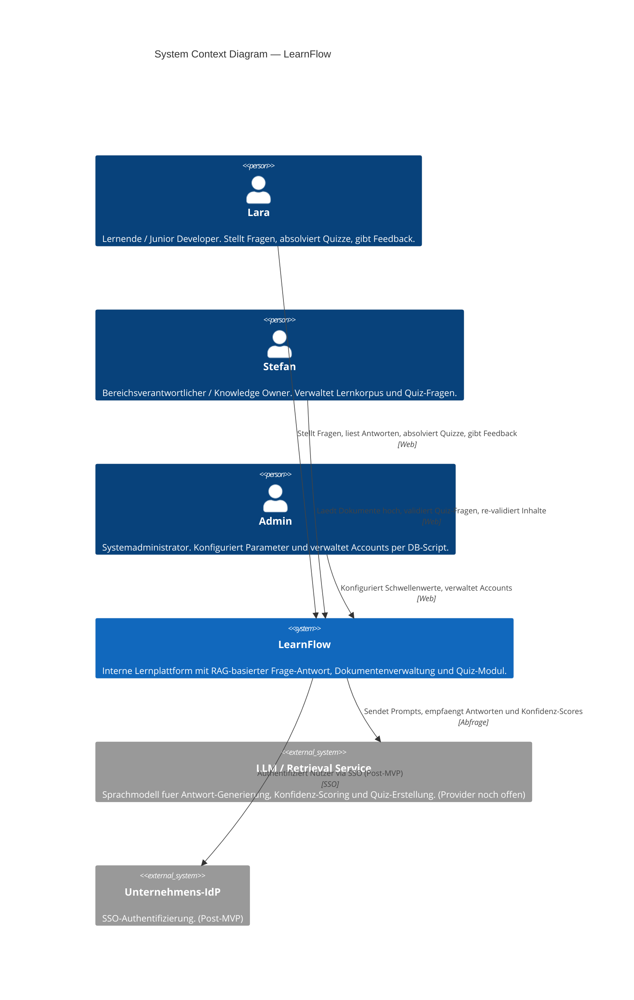

# LearnFlow — C4 System Context Diagram v1
*Modul 3 Tag 1 · Mai 2026*

---

---

## Legende

| Element | Beschreibung |
|---|---|
| **Lara** | Lernende — primäre Nutzerin der Q&A- und Quiz-Funktion |
| **Stefan** | Bereichsverantwortlicher — kuratiert den Wissenskorpus |
| **Admin** | Systemadministrator — konfiguriert Parameter, legt Accounts per DB-Script an |
| **LearnFlow** | Das zu bauende System (Scope dieser Arbeit) |
| **LLM / Retrieval Service** | Externer KI-Dienst für Antwort-Generierung und Quiz-Erstellung; Provider noch nicht entschieden (Risiko 3) |
| **Unternehmens-IdP** | Externer Identitätsprovider für SSO-Authentifizierung — explizit Post-MVP |

---

*Quelle: LearnFlow_Requirements_v1.md · Stand v1 — 2026-05-26*
