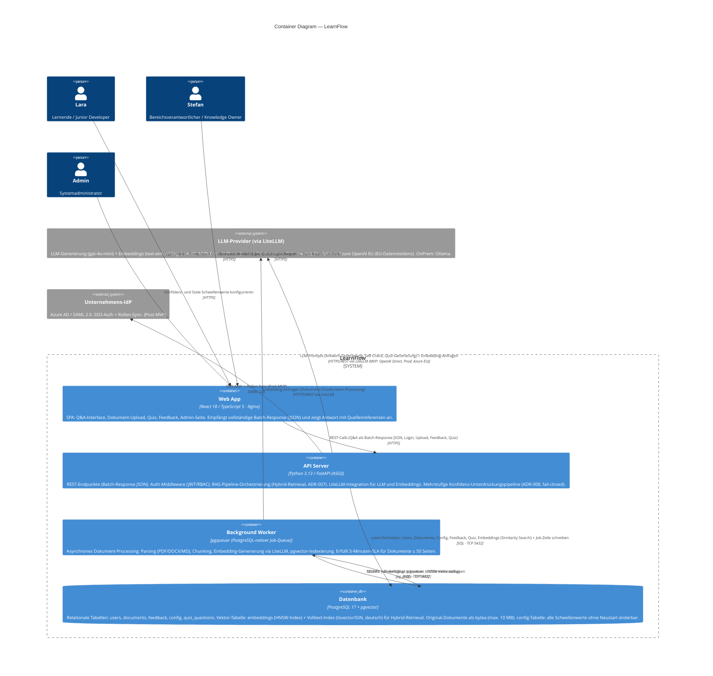

# LearnFlow — C4 Container Diagram (Level 2)
*Modul 3 Tag 1 · Mai 2026*

---

## Diagramm (Mermaid)



---

## Container-Übersicht

### 1. Container — Fragen und Begründungen

#### 1.1 Welche Container brauchen wir?

| Container | Technologie | Begründung (1 Satz) |
|---|---|---|
| **Web App** | React 18 / TypeScript 5, Vite, Nginx | Standard `fetch()` für Batch-Response JSON — kein SSE-State-Management nötig; HTMX wäre umständlicher für Quiz, Feedback-UI und Quellenhervorhebung. |
| **API Server** | Python 3.13 / FastAPI (ASGI) | Async-native (ASGI), RBAC-Middleware und das gesamte Python-KI-Ökosystem (LiteLLM, LangChain, pypdf, python-docx) direkt verfügbar — kein Adapter-Layer. |
| **Background Worker** | pgqueuer (PostgreSQL-nativer Job-Queue) | Dokument-Processing (Parsing → Chunking → Embedding → Indexierung) muss asynchron laufen, damit der Upload sofort bestätigt wird und der 5-Minuten-SLA eingehalten wird. |
| **Datenbank** | PostgreSQL 17 + pgvector | Ein einziger Server für relationale Daten, Vektor-Embeddings (pgvector HNSW), Volltext-Index (tsvector/GIN) für Hybrid-Retrieval und Original-Dokumente (bytea, max. 10 MB) — ein Backup, eine Verbindungskonfiguration, kein zweiter Service. |

#### 1.2 Welche Technologien passen zu unseren QAs?

| QA | Container | Technologie-Entscheid |
|---|---|---|
| **Reliability** | API Server | Mehrschichtiger Unterdrückungsmechanismus (Quellenprüfung → Konfidenz → Self-Check) als Pipeline im API Server; Circuit Breaker für LiteLLM-Aufrufe. |
| **Reliability** | Datenbank | Konfidenz- und Stale-Schwellenwerte in `config`-Tabelle — empirisch kalibrierbar ohne Deployment. |
| **Security** | API Server | JWT (8 h) + bcrypt-Hashing; RBAC-Middleware; pseudonymisiertes Feedback-Schreiben; serverseitige URL-Abweisung ohne Admin-Rolle. |
| **Maintainability** | API Server | LiteLLM-Abstraktion: Provider-Wechsel (Azure OpenAI EU ↔ OpenAI Direct ↔ Ollama) ist ein Konfigurationseintrag in der `config`-Tabelle — kein Code-Change. |
| **Performance** | API Server + Web App | FastAPI async Batch-Response + Ladeanimation im Frontend; Wartezeit ≤ 10 s p95 über Retrieval-Optimierung (pgvector HNSW, ADR-007). |
| **Performance** | Datenbank | pgvector HNSW-Index liefert Sub-100-ms-Latenz bei Similarity Search für < 10 000 Chunks. |
| **Performance** | Background Worker | Dokument-Processing asynchron — Upload wird sofort bestätigt, Verarbeitung läuft im Hintergrund. |
| **Testability** | Background Worker + API Server | Modulare RAG-Komponenten (Chunking, Embedding, Retrieval, Generierung) — jede einzeln isolierbar und testbar; Evaluationsdataset läuft im CI gegen jede Komponente. |

#### 1.3 Wie kommunizieren die Container miteinander?

| Von | Nach | Inhalt | Protokoll |
|---|---|---|---|
| Browser (Lara/Stefan/Admin) | Web App | HTML/JS/CSS ausliefern | HTTPS |
| Web App | API Server | REST-Calls (Q&A Batch-Response JSON, Login, Upload, Feedback, Quiz) | HTTPS |
| API Server | Datenbank | Lesen/Schreiben: Users, Dokumente, Config, Feedback, Quiz-Fragen; Similarity Search (Embeddings) | SQL · TCP 5432 |
| API Server | Datenbank | Job-Zeile schreiben + pg_notify auslösen (nach Upload) | SQL · TCP 5432 |
| Datenbank | Background Worker | NOTIFY: Job verfügbar — PostgreSQL liefert an pgqueuer LISTEN-Verbindung | pg_notify · TCP 5432 |
| Background Worker | Datenbank | Chunks + Embeddings schreiben; HNSW-Index aufbauen | SQL · TCP 5432 |
| API Server | LLM-Provider (via LiteLLM) | LLM-Prompts (Antwort, Self-Check, Quiz-Generierung) + Embedding-Anfragen — MVP: OpenAI Direct, Prod: Azure OpenAI EU | HTTPS/REST |
| Background Worker | LLM-Provider (via LiteLLM) | Embedding-Anfragen für Dokument-Chunks beim Processing | HTTPS/REST |
| API Server | Unternehmens-IdP | SSO-Authentifizierung + Rollen-Sync *(Post-MVP)* | SAML 2.0 |

---

## 2. RAG-Request-Flow (Happy Path)

```
Lara tippt Frage
       │
       ▼
  [Web App]
  Eingabe validieren (3–1000 Zeichen)
       │ POST /api/query  (HTTPS)
       ▼
  [API Server]
  1. Auth prüfen (JWT)
  2. Query-Embedding generieren  ──► [LLM-Provider via LiteLLM] text-embedding-3-small
  3. Hybrid-Retrieval (ADR-007)   ──► [Datenbank] pgvector HNSW + tsvector/GIN, RRF-Fusion
  4. Retrieval-Gate (ADR-007): Chunk über Similarity-Schwelle?
     └── nein → "Weiss ich nicht" (kein LLM-Aufruf)
  5. Retrieval-Konfidenz prüfen (ADR-008, Stufe 1)
     └── zu tief → "Weiss ich nicht"
  6. LLM-Prompt aufbauen + senden ──► [LLM-Provider via LiteLLM] gpt-4o-mini
  7. Grounding-/Citation-Check (ADR-008, Stufe 2)
     └── Coverage < 50 % → unterdrückt
  8. Self-Check für Grenzfälle (ADR-008, Stufe 3, optional)
  9. Batch-Response senden (JSON: Antwort + Quellenreferenzen + Konfidenz-Score)
       │ application/json
       ▼
  [Web App]
  Antwort + Quellenreferenzen anzeigen (Ladeanimation während Verarbeitung)
```

---

## 3. Dokument-Upload-Flow (Hintergrund-Processing)

```
Stefan lädt PDF hoch
       │
       ▼
  [Web App]
  POST /api/documents  (multipart/form-data)
       │
       ▼
  [API Server]
  1. Auth + Rolle prüfen (Bereichsverantwortlicher)
  2. Datei in DB speichern (bytea, max. 10 MB — serverseitig geprüft), Zeitstempel setzen
  3. Job in Queue schreiben (Dokument-ID)
  4. Sofortige Bestätigung an Stefan → "Upload erfolgreich, Verarbeitung läuft"
       │
       ▼
  [Background Worker]
  1. Dokument aus DB laden
  2. Text extrahieren (pypdf / python-docx)
  3. Text chunken (struktur-bewusst, ~512 Token / 64 Overlap — ADR-007)
  4. Chunks embedden  ──► [LLM-Provider via LiteLLM] text-embedding-3-small
  5. Embeddings + Chunks + tsvector in DB schreiben, HNSW-Index aktualisieren
  6. Dokument-Status: "verfügbar"
  → Innerhalb 5 Minuten für Dokumente ≤ 50 Seiten / 10 MB
```

---

## 4. Entscheid — Background Worker

**pgqueuer** — entschieden 2026-05-27 (ADR-006).

Jobs werden in einer PostgreSQL-Tabelle persistiert. Der Worker nutzt `pg_notify` für sofortige Benachrichtigung — kein Redis, kein separater Broker. Details und Begründung: `04_ADR-006_Background-Worker.md`.

---

## 5. Deployment-Übersicht (Docker Compose — MVP)

```
docker-compose.yml
├── webapp        (Nginx + React Build)        Port 80/443
├── api           (FastAPI / Uvicorn)           Port 8000 (intern)
├── worker        (pgqueuer)                    kein externer Port
└── db            (PostgreSQL 17 + pgvector)    Port 5432 (intern)
```

Single Instance — kein HA-Setup. Bewusst akzeptiert für Business-Hours-Pilot mit < 30 Nutzern.

**LLM-Provider im MVP:** OpenAI Direct (nur API-Key, kein Azure-Setup) — zulässig, weil im MVP keine echten internen Dokumente verarbeitet werden. Umstellung auf Azure OpenAI EU als harte Vorbedingung *vor* dem ersten echten internen Dokument (eine LiteLLM-Konfigurationszeile; vgl. ADR-004/005).

---

*Quellen: 03_QualityAttributes.md · 05_C4-C1_System-Context.md · 04_ADR-001 bis 04_ADR-009*
*Stand: v4 — 2026-05-31 · MVP-Provider-Staffelung (OpenAI Direct → Azure OpenAI EU) eingearbeitet (ADR-004/005)*
