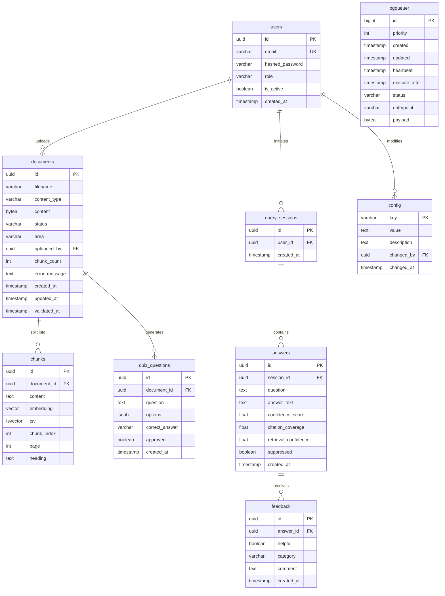

# Entity Relationship Diagram — LearnFlow

| Feld          | Inhalt                                           |
| ------------- | ------------------------------------------------ |
| **Stand**     | 2026-06-17                                       |
| **Verfasser** | LearnFlow-Team                                   |
| **Quellen**   | ADR-003 · ADR-006 · ADR-007 · ADR-008 · US-01–11 |

---

## Sprint-Status

| Farbe / Markierung | Bedeutung                          |
| ------------------ | ---------------------------------- |
| ✅ Vorhanden        | Migration bereits deployed         |
| 🔵 Sprint 1        | T-11 / T-13 — aktueller Sprint     |
| 🟡 Zukunft         | geplant, noch nicht implementiert  |
| ⬜ SHOULD / T-34    | SHOULD-Priorität, separates Issue  |

---

## Diagramm

---

## Feld-Notizen

### `documents`
| Feld | Typ | Anmerkung |
|---|---|---|
| `content` | `bytea` | Original-Datei ≤ 10 MB (ADR-003) |
| `status` | `varchar` | `queued` · `processing` · `ready` · `error` |
| `validated_at` | `timestamp` | Stale-Uhr für US-06 (reset bei Upload + Re-Validierung) |
| `embedding` | `vector(1536)` | `text-embedding-3-small`; OnPrem: 1024 (`bge-m3`) (ADR-005) |

### `chunks`
| Feld | Typ | Anmerkung |
|---|---|---|
| `embedding` | `vector(1536)` | HNSW-Index `vector_cosine_ops` m=16, ef=64 (ADR-003/007) |
| `tsv` | `tsvector` | GIN-Index, `to_tsvector('german', …)` — Sparse-Retrieval (ADR-007) |

### `config`
Konfigurierbare Parameter (ADR-007 · ADR-008 · US-02 · US-06 · US-11):

| Key | Startwert | Zweck |
|---|---|---|
| `similarity_threshold` | `0.35` | Retrieval-Gate (ADR-007) |
| `min_retrieval_confidence` | `0.40` | Stufe 1 (ADR-008) |
| `min_citation_coverage` | `0.50` | Stufe 2 (ADR-008) |
| `stale_days` | `90` | US-06 |
| `rrf_k` | `60` | RRF-Fusion (ADR-007) |
| `retrieval_top_k` | `20` | Kandidaten je Suche (ADR-007) |
| `context_top_n` | `5` | Chunks an LLM (ADR-007) |

`changed_by` + `changed_at` erfüllen das US-11-Audit-Log-Kriterium (kein separates Log nötig).

### `feedback`
Pseudonymisiert — kein `user_id`-Feld (US-03).

### `quiz_questions`
SHOULD-Priorität (US-07 / US-08). Eigenes Issue T-34, nicht im aktuellen Sprint.

---

## Migrations-Reihenfolge

| Migration | Tabellen | Status |
|---|---|---|
| `0001_pgqueuer` | `pgqueuer` | ✅ deployed |
| `0002_users` | `users` | ✅ deployed |
| `0003_documents_chunks` | `documents` · `chunks` · pgvector-Extension · HNSW · GIN | 🔵 T-11 / T-13 |
| `0004_rag_tables` | `query_sessions` · `answers` · `feedback` · `config` | 🟡 Zukunft |
| `0005_quiz` | `quiz_questions` | ⬜ T-34 |
