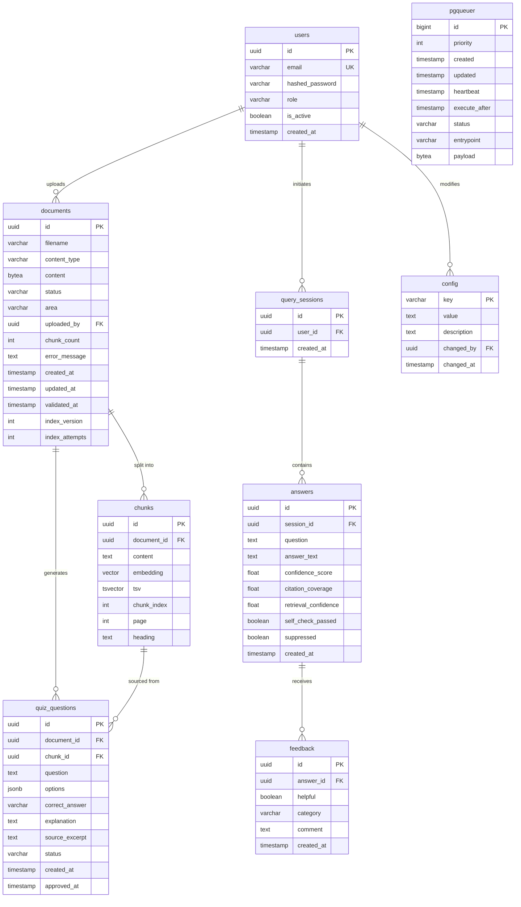

# Entity Relationship Diagram — LearnFlow

| Feld          | Inhalt                                           |
| ------------- | ------------------------------------------------ |
| **Stand**     | 2026-06-17                                       |
| **Verfasser** | LearnFlow-Team                                   |
| **Quellen**   | ADR-003 · ADR-006 · ADR-007 · ADR-008 · US-01–11 |

---

## Sprint-Status

| Farbe / Markierung | Bedeutung                          |
| ------------------ | ---------------------------------- |
| ✅ Vorhanden        | Migration bereits deployed         |
| 🔵 Sprint 1        | T-11 / T-13 — aktueller Sprint     |
| 🟡 Zukunft         | geplant, noch nicht implementiert  |
| ⬜ SHOULD / T-34    | SHOULD-Priorität, separates Issue  |

---

## Diagramm

```mermaid
erDiagram

    %% ── Bestehend ───────────────────────────────────────────
    users {
        uuid        id              PK
        varchar     email           UK
        varchar     hashed_password
        varchar     role
        boolean     is_active
        timestamp   created_at
    }

    pgqueuer {
        bigint      id           PK
        int         priority
        timestamp   created
        timestamp   updated
        timestamp   heartbeat
        timestamp   execute_after
        varchar     status
        varchar     entrypoint
        bytea       payload
    }

    %% ── Sprint 1 (T-11 / T-13) ──────────────────────────────
    documents {
        uuid        id           PK
        varchar     filename
        varchar     content_type
        bytea       content
        varchar     status
        varchar     area
        uuid        uploaded_by  FK
        int         chunk_count
        text        error_message
        timestamp   created_at
        timestamp   updated_at
        timestamp   validated_at
        int         index_version
        int         index_attempts
    }

    chunks {
        uuid        id           PK
        uuid        document_id  FK
        text        content
        vector      embedding
        tsvector    tsv
        int         chunk_index
        int         page
        text        heading
    }

    %% ── Zukunft ─────────────────────────────────────────────
    query_sessions {
        uuid        id           PK
        uuid        user_id      FK
        timestamp   created_at
    }

    answers {
        uuid        id                  PK
        uuid        session_id          FK
        text        question
        text        answer_text
        float       confidence_score
        float       citation_coverage
        float       retrieval_confidence
        boolean     self_check_passed
        boolean     suppressed
        timestamp   created_at
    }

    feedback {
        uuid        id          PK
        uuid        answer_id   FK
        boolean     helpful
        varchar     category
        text        comment
        timestamp   created_at
    }

    config {
        varchar     key         PK
        text        value
        text        description
        uuid        changed_by  FK
        timestamp   changed_at
    }

    %% ── SHOULD · T-33 / T-34 ─────────────────────────────────
    quiz_questions {
        uuid        id             PK
        uuid        document_id    FK
        uuid        chunk_id       FK
        text        question
        jsonb       options
        varchar     correct_answer
        text        explanation
        text        source_excerpt
        varchar     status
        timestamp   created_at
        timestamp   approved_at
    }

    %% ── Beziehungen ──────────────────────────────────────────
    users           ||--o{ documents       : "uploads"
    users           ||--o{ query_sessions  : "initiates"
    users           ||--o{ config          : "modifies"
    documents       ||--o{ chunks          : "split into"
    documents       ||--o{ quiz_questions  : "generates"
    chunks          ||--o{ quiz_questions  : "sourced from"
    query_sessions  ||--o{ answers         : "contains"
    answers         ||--o{ feedback        : "receives"
```

---

## Feld-Notizen

### `documents`
| Feld | Typ | Anmerkung |
|---|---|---|
| `content` | `bytea` | Original-Datei ≤ 10 MB (ADR-003) |
| `status` | `varchar` | `queued` · `processing` · `ready` · `error` |
| `validated_at` | `timestamp` | Stale-Uhr für US-06 (reset bei Upload + Re-Validierung) |
| `index_version` | `int` | Optimistic-Lock-Token zwischen API und Worker (T-15 · T-43). Hochgezählt von genau zwei Schreibern, die dasselbe damit meinen — „jeder ältere Indexierungslauf ist ungültig": vom Upload (neue Bytes) und vom Reaper (Lauf für tot erklärt). Der Worker liest es mit dem Inhalt und veröffentlicht nur, wenn es noch passt. |
| `index_attempts` | `int` | Budget des Reapers: wie oft ein abgebrochener Lauf für diese Fassung neu eingereiht wurde. Beim Upload zurückgesetzt. |
| `embedding` | `vector(1536)` | `text-embedding-3-small`; OnPrem: 1024 (`bge-m3`) (ADR-005) |

### `chunks`
| Feld | Typ | Anmerkung |
|---|---|---|
| `embedding` | `vector(1536)` | HNSW-Index `vector_cosine_ops` m=16, ef=64 (ADR-003/007) |
| `tsv` | `tsvector` | GIN-Index, `to_tsvector('german', …)` — Sparse-Retrieval (ADR-007) |

### `config`
Konfigurierbare Parameter (ADR-007 · ADR-008 · US-02 · US-06 · US-11):

| Key | Startwert | Zweck |
|---|---|---|
| `chunk_size` | `512` | Chunk-Grösse in Token (ADR-007) |
| `chunk_overlap` | `64` | Overlap in Token (ADR-007) |
| `similarity_threshold` | `0.35` | Retrieval-Gate (ADR-007) |
| `min_retrieval_confidence` | `0.40` | Stufe 1 (ADR-008) |
| `min_citation_coverage` | `0.50` | Stufe 2 (ADR-008) |
| `confidence_threshold_high` | `0.75` | Band-Grenze Komposit-Score „Hoch" (ADR-008 · US-02) |
| `confidence_threshold_medium` | `0.45` | Band-Grenze „Mittel"; darunter unterdrückt (ADR-008 · US-02) |
| `self_check_band_low` | `0.45` | Untere Grenze des Self-Check-Grenzbands (ADR-008 Stufe 3) |
| `self_check_band_high` | `0.75` | Obere Grenze; ab hier wird Stufe 3 übersprungen (ADR-008 Stufe 3) |
| `stale_days` | `90` | US-06 |
| `rrf_k` | `60` | RRF-Fusion (ADR-007) |
| `retrieval_top_k` | `20` | Kandidaten je Suche (ADR-007) |
| `context_top_n` | `5` | Chunks an LLM (ADR-007) |
| `processing_timeout_seconds` | `900` | Ab wann ein beanspruchter Indexierungslauf als verwaist gilt (T-43) |
| `processing_max_attempts` | `3` | Wie oft der Reaper neu einreiht, bevor er `failed` setzt (T-43) |

`changed_by` + `changed_at` erfüllen das US-11-Audit-Log-Kriterium (kein separates Log nötig).

Die beiden Konfidenz-Bänder sind seit `0009` in der DB validiert (Wert numerisch in [0, 1] per
`CHECK`, `medium <= high` per aufgeschobenem `CONSTRAINT TRIGGER`) — die Tabelle bleibt generisch
Key/Value, die Regeln hängen am Key. Begründung: ADR-008, Nachtrag 2026-08-16. `0012` hat den
`CHECK` auf die Retrieval-Parameter ausgeweitet, `0014` auf das Self-Check-Grenzband — dort mit
einem zweiten Trigger für `low <= high`, weil ein invertiertes Band Stufe 3 unbemerkt abschaltet
(ADR-008, Nachtrag 2026-08-22).

### `feedback`
Pseudonymisiert — kein `user_id`-Feld (US-03).

### `quiz_questions`
SHOULD-Priorität (US-07 / US-08). Schema und Generierungs-Endpoint gemeinsam in T-33 / T-34,
weil sich erst am Endpoint entscheidet, welche Felder eine generierte Frage braucht.

`options` ist ein JSON-Array aus genau vier Strings (`CHECK`), `correct_answer` der Buchstabe
`A`–`D`, der es indiziert. `status` ersetzt das frühere Boolean `approved` und kennt
`pending` / `approved` / `rejected` (`CHECK`); der Default `pending` ist die fail-closed-Zusage,
dass nichts ohne menschliche Freigabe sichtbar wird (ADR-008). `approved_at` ist der Zeitpunkt der
Freigabe (US-07) und damit nicht `created_at`, der Zeitpunkt der Generierung.

`chunk_id` und `source_excerpt` halten dieselbe Quelle zweimal fest, mit Absicht. Wird ein Dokument
durch eine neue Fassung ersetzt (T-15), verschwinden die Chunks der alten — die Fragen überleben
das, verlieren aber ihre Freigabe und fallen auf `pending` zurück. `chunk_id` wird dabei über
`ON DELETE SET NULL` zu NULL und ist damit die Markierung „stammt aus einer ersetzten Fassung";
`source_excerpt` ist die einzige verbliebene Kopie der Passage, gegen die Stefan erneut prüft.

---

## Migrations-Reihenfolge

| Migration | Tabellen | Status |
|---|---|---|
| `0001_pgqueuer` | `pgqueuer` | ✅ deployed |
| `0002_users` | `users` | ✅ deployed |
| `0003_documents_chunks` | `documents` · `chunks` · pgvector-Extension · HNSW · GIN | 🔵 T-11 / T-13 |
| `0004_rag_tables` | `query_sessions` · `answers` · `feedback` · `config` | 🟡 Zukunft |
| `0005_quiz` | `quiz_questions` | 🔵 T-34 |
| `0006_documents_status_default` | `documents.status`-Default auf `pending` | ✅ deployed |
| `0007_chunking_config` | `config`: `chunk_size` · `chunk_overlap` | 🔵 T-12 |
| `0008_confidence_thresholds` | `config`: `confidence_threshold_high` · `confidence_threshold_medium` | 🔵 T-24 |
| `0009_config_threshold_constraints` | `config`: `CHECK` + `CONSTRAINT TRIGGER` auf den Konfidenz-Bändern | 🔵 #73 |
| `0010_feedback_answer_id_index` | `feedback`: Index auf `answer_id` | 🔵 T-32 |
| `0011_feedback_answer_id_unique` | `feedback`: `answer_id` eindeutig — eine Bewertung je Antwort | 🔵 T-32 |
| `0012_config_pipeline_constraints` | `config`: `CHECK` auf die Retrieval-Parameter ausgeweitet | 🔵 T-17 |
| `0013_documents_area_filename_unique` | `documents`: `(area, filename)` eindeutig | 🔵 T-15 |
| `0014_self_check_band` | `config`: `self_check_band_low` · `self_check_band_high` + Bandordnungs-Trigger | 🔵 T-25 |
| `0015_answers_self_check` | `answers`: `self_check_passed` | 🔵 T-25 |
| `0016_quiz_review_schema` | `quiz_questions`: `chunk_id` · `source_excerpt` · `explanation` · `status` · `approved_at` | 🔵 T-33 / T-34 |
