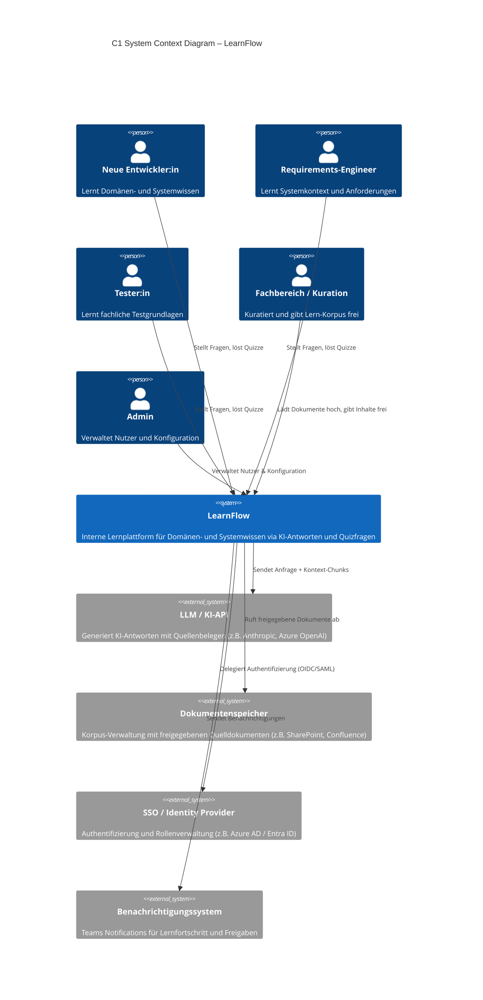

# C4 System Context Diagram – LearnFlow

---

## Zeichnet hier euer C1 Diagram (oder beschreibt die Elemente):

### System-Name (Mitte):

**LearnFlow** – Interne Lernplattform, die neuen Entwickler:innen, Requirements-Engineers und Tester:innen das Domänen- und Systemwissen historisch gewachsener Fachanwendungen über quellenbasierte KI-Antworten und überprüfte Quizfragen zugänglich macht.

---

### Nutzertypen (wer interagiert?):

| Nutzertyp | Rolle | Interaktion |
|---|---|---|
| **Neue Entwickler:in** | Lernende | Stellt Fragen, löst Quizze, navigiert Lernpfade |
| **Requirements-Engineer** | Lernende | Stellt Fragen zu Systemkontext und Anforderungen, löst Quizze |
| **Tester:in** | Lernende | Lernt fachliche Testgrundlagen, stellt Fragen, löst Quizze |
| **Fachbereich / Kuration** | Inhalt-Verantwortliche:r | Lädt Dokumente hoch, gibt Inhalte frei, bewertet KI-Antworten |
| **Admin** | Betrieb | Verwaltet Benutzerkonten, Rollen und Systemkonfiguration |

---

### Externe Systeme (welche Abhängigkeiten?):

| System | Typ | Abhängigkeit |
|---|---|---|
| **LLM / KI-API** (z.B. Anthropic, Azure OpenAI) | Externes System | LearnFlow sendet Anfragen + Kontext-Chunks; erhält KI-Antworten mit Quellenbelegen |
| **Dokumentenspeicher / Korpus-Verwaltung** (z.B. SharePoint, Confluence) | Externes System | LearnFlow ruft freigegebene Quelldokumente für RAG-Suche ab |
| **SSO / Identity Provider** (z.B. Azure AD / Entra ID) | Externes System | LearnFlow delegiert Authentifizierung und Rollenvergabe (OIDC/SAML) |
| **Benachrichtigungssystem** (Teams) | Externes System | LearnFlow sendet event-basierte Lernfortschritt- und Freigabe-Benachrichtigungen |

---

## Diagram als Mermaid



---

## Diagram als PlantUML

```plantuml
@startuml C1_LearnFlow
!include https://raw.githubusercontent.com/plantuml-stdlib/C4-PlantUML/master/C4_Context.puml

LAYOUT_WITH_LEGEND()

title C1 System Context Diagram – LearnFlow

Person(dev,      "Neue Entwickler:in",      "Lernt Domänen- und\nSystemwissen")
Person(re,       "Requirements-Engineer",   "Lernt Systemkontext\nund Anforderungen")
Person(tester,   "Tester:in",               "Lernt fachliche\nTestgrundlagen")
Person(curator,  "Fachbereich / Kuration",  "Kuratiert und gibt\nLern-Korpus frei")
Person(admin,    "Admin",                   "Verwaltet Nutzer\nund Konfiguration")

System(learnflow, "LearnFlow", "Interne Lernplattform für Domänen- und\nSystemwissen via KI-Antworten und Quizfragen")

System_Ext(llm,      "LLM / KI-API",                "Generiert KI-Antworten mit Quellenbelegen\n(z.B. Anthropic, Azure OpenAI)")
System_Ext(docstore, "Dokumentenspeicher",           "Korpus-Verwaltung mit freigegebenen\nQuelldokumenten (z.B. SharePoint, Confluence)")
System_Ext(sso,      "SSO / Identity Provider",      "Authentifizierung und Rollenverwaltung\n(z.B. Azure AD / Entra ID)")
System_Ext(notify,   "Benachrichtigungssystem",      "Teams Notifications\nfür Lernfortschritt und Freigaben")

Rel(dev,     learnflow, "Stellt Fragen, löst Quizze")
Rel(re,      learnflow, "Stellt Fragen, löst Quizze")
Rel(tester,  learnflow, "Stellt Fragen, löst Quizze")
Rel(curator, learnflow, "Lädt Dokumente hoch, gibt Inhalte frei")
Rel(admin,   learnflow, "Verwaltet Nutzer & Konfiguration")

Rel(learnflow, llm,      "Sendet Anfrage + Kontext-Chunks", "HTTPS/REST")
Rel(learnflow, docstore, "Ruft freigegebene Dokumente ab",  "HTTPS/API")
Rel(learnflow, sso,      "Delegiert Authentifizierung",     "OIDC/SAML")
Rel(learnflow, notify,   "Sendet Benachrichtigungen",       "HTTPS/Webhook")

@enduml
```

---

## Diagramm (ASCII-Textbeschreibung)

```
┌──────────────────────────────────────────────────────────────────────────────────┐
│                              SYSTEM CONTEXT                                      │
│                                                                                  │
│  [Person]                    [Person]                     [Person]               │
│  Neue Entwickler:in          Requirements-Engineer        Tester:in              │
│  Lernt Domänen- und          Lernt Systemkontext          Lernt fachliche        │
│  Systemwissen                und Anforderungen            Testgrundlagen         │
│        │                           │                           │                 │
│        │ Stellt Fragen,            │ Stellt Fragen,           │ Stellt Fragen,  │
│        │ löst Quizze               │ löst Quizze              │ löst Quizze     │
│        └───────────────────────────┴───────────────────┬──────┘                 │
│                                                        ▼                         │
│  [Person]                                   ┌─────────────────────┐             │
│  Fachbereich / Kuration                     │                     │             │
│  Gibt Inhalte frei,         ──lädt Dok.──►  │     LearnFlow       │             │
│  kuratiert Lern-Korpus      ◄─Feedback──    │                     │             │
│                                             │  Interne Lernplatt- │             │
│  [Person]                                   │  form für fachliches│             │
│  Admin                      ──verwaltet──►  │  Domänen- und       │             │
│  Verwaltet Nutzer &                         │  Systemwissen       │             │
│  Systemkonfiguration                        │                     │             │
│                                             └──────────┬──────────┘             │
│                                                        │                         │
│               ┌────────────────────┬──────────────────┼──────────────────┐      │
│               │                    │                  │                  │      │
│               ▼                    ▼                  ▼                  ▼      │
│  [Ext. System]         [Ext. System]       [Ext. System]      [Ext. System]     │
│  LLM / KI-API          Dokumentenspeicher  SSO / Identity     Benachrichtigung  │
│  (z.B. Anthropic /     Korpus-Verwaltung   Provider           (Teams)           │
│   Azure OpenAI)        (z.B. SharePoint /  (z.B. Azure AD /   Sendet Lernfort-  │
│  Generiert KI-         Confluence)         Entra ID)          schritt-Updates   │
│  Antworten mit         Liefert freigegebene Authentifiziert                     │
│  Quellenbelegen        Quelldokumente      alle Nutzer                          │
│                                                                                  │
└──────────────────────────────────────────────────────────────────────────────────┘
```

---

## Was haben wir vergessen?

### Fehlende Nutzertypen
| Lücke | Begründung |
|---|---|
| **IT-Betrieb / Ops** | Wer deployed, konfiguriert Infrastruktur und reagiert auf Incidents? |
| **Compliance / Security Officer** | Muss prüfen, ob Daten (Quellen, Nutzerdaten) intern bleiben; DSGVO-relevant |
| **Lernpfad-Designer / Didaktiker:in** | Wer strukturiert Quizfragen und Lernpfade inhaltlich? Nicht identisch mit Fachbereich |

### Fehlende externe Systeme
| Lücke | Begründung |
|---|---|
| **Logging / Monitoring** | Wohin gehen Fehler-Logs, Traces, Metriken? (z.B. Azure Monitor, Datadog) |
| **HR-System / Active Directory** | Automatisches Onboarding neuer Mitarbeiter:innen; Offboarding bei Austritt |
| **Vektordatenbank** | Für RAG-Architektur braucht LearnFlow eine Embedding-Suche (z.B. Azure AI Search, Qdrant) – derzeit versteckt in «Dokumentenspeicher», sollte eigenes Element sein |
| **Content-Versionierung / Audit-Log** | Wer hat welches Dokument wann freigegeben? Nachvollziehbarkeit für Compliance |
| **Feedback- / Analytics-System** | Wie messen wir Lernfortschritt und Qualität der Antworten? (z.B. Posthog, Application Insights) |

### Fehlende Interaktionen
| Lücke | Begründung |
|---|---|
| **Quellen-Feedback-Loop** | Lernende können Antworten bewerten → Feedback fliesst zurück an Fachbereich |
| **Quiz-Freigabeprozess** | Wer prüft und gibt Quizfragen frei, bevor sie Lernenden angezeigt werden? |
| **Dokument-Update-Trigger** | Wenn eine Quelle im Dokumentenspeicher aktualisiert wird, muss LearnFlow Re-Indexierung anstossen |
