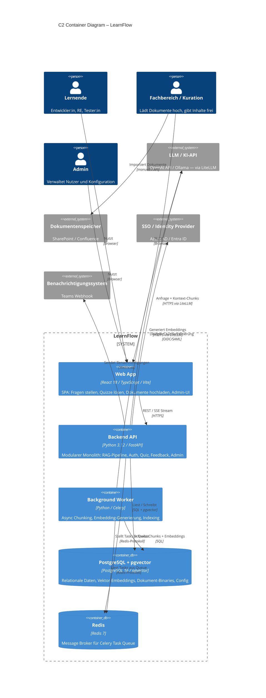

# C4 Container Diagram – LearnFlow

---

## Zeichnet hier euer C2 Diagram (oder beschreibt die Elemente):

### System-Name (Mitte):

**LearnFlow** — Modularer Monolith, deployed als Docker-Compose-Stack.

---

### Nutzertypen (wer interagiert?):

| Nutzertyp | Interaktion |
|---|---|
| **Lernende** (Entwickler:in, RE, Tester:in) | Browser → Web App: Fragen stellen, Quizze lösen, Lernpfade navigieren |
| **Fachbereich / Kuration** | Browser → Web App: Dokumente hochladen, Inhalte freigeben, Qualität bewerten |
| **Admin** | Browser → Web App: Nutzer verwalten, Konfiguration anpassen |

---

### Externe Systeme (welche Abhängigkeiten?):

| System | Protokoll | Richtung |
|---|---|---|
| **LLM / KI-API** (OpenAI / Ollama via LiteLLM) | HTTPS/REST | Backend API → LLM (Anfragen), Background Worker → LLM (Embeddings) |
| **Dokumentenspeicher** (SharePoint / Confluence) | manuell / API | Kuration importiert Dokumente → Web App |
| **SSO / Identity Provider** (Azure AD / Entra ID) | OIDC/SAML | Backend API → SSO (Auth-Delegation) |
| **Benachrichtigungssystem** (Teams) | Webhook | Backend API → Teams |

---

## C2 — Container Diagram: Unsere Technologie-Entscheidungen

| Container | Technologie | Aufgabe | Kommuniziert mit |
|---|---|---|---|
| **Web App** | React 18, TypeScript 5, Vite | SPA: Fragen stellen, Quizze lösen, Dokumente hochladen, Admin-UI, SSE-Stream für Token-by-Token-Antworten | Backend API (REST + SSE über HTTPS) |
| **Backend API** | Python 3.12, FastAPI (ASGI) | Modularer Monolith: RAG-Pipeline, Auth (JWT + RBAC), Quiz, Feedback, Dokument-Management, Admin | Web App, PostgreSQL, Redis, LLM/KI-API, SSO, Teams |
| **Background Worker** | Python, Celery | Async Dokument-Processing: Chunking, Embedding-Generierung, pgvector-Indexing (5-Minuten-SLA nach Upload) | Redis (Task Queue), PostgreSQL, LLM/KI-API (Embeddings via LiteLLM) |
| **PostgreSQL + pgvector** | PostgreSQL 16, pgvector-Extension, Alembic | Relationale Daten (User, Dokumente, Quiz, Feedback, Config-Tabelle) + Vektor-Embeddings (HNSW-Index) + Dokument-Binaries (bytea) | Backend API, Background Worker |
| **Redis** | Redis 7 | Message Broker für Celery Task Queue — kein Cache | Backend API (Producer), Background Worker (Consumer) |

---

## Diagram als Mermaid



---

## Diagram als PlantUML

```plantuml
@startuml C2_LearnFlow
!include https://raw.githubusercontent.com/plantuml-stdlib/C4-PlantUML/master/C4_Container.puml

LAYOUT_WITH_LEGEND()

title C2 Container Diagram – LearnFlow

Person(learner, "Lernende", "Entwickler:in, RE, Tester:in")
Person(curator, "Fachbereich / Kuration", "Lädt Dokumente hoch, gibt Inhalte frei")
Person(admin, "Admin", "Verwaltet Nutzer und Konfiguration")

System_Boundary(learnflow, "LearnFlow") {
  Container(webapp,  "Web App",             "React 18 / TypeScript / Vite",  "SPA: Fragen stellen, Quizze lösen,\nDokumente hochladen, Admin-UI")
  Container(api,     "Backend API",          "Python 3.12 / FastAPI",         "Modularer Monolith: RAG-Pipeline,\nAuth, Quiz, Feedback, Admin")
  Container(worker,  "Background Worker",    "Python / Celery",               "Async Chunking, Embedding-\nGenerierung, pgvector-Indexing")
  ContainerDb(db,    "PostgreSQL + pgvector","PostgreSQL 16 / pgvector",      "Relational + Vektoren + Binaries\n+ Config-Tabelle")
  ContainerDb(redis, "Redis",                "Redis 7",                       "Message Broker\nfür Celery Task Queue")
}

System_Ext(llm,      "LLM / KI-API",           "OpenAI API / Ollama (via LiteLLM)")
System_Ext(docstore, "Dokumentenspeicher",      "SharePoint / Confluence")
System_Ext(sso,      "SSO / Identity Provider", "Azure AD / Entra ID")
System_Ext(notify,   "Benachrichtigungssystem", "Teams Webhook")

Rel(learner,  webapp,    "Nutzt",                      "Browser")
Rel(curator,  webapp,    "Nutzt",                      "Browser")
Rel(admin,    webapp,    "Nutzt",                      "Browser")

Rel(webapp,  api,    "REST / SSE Stream",           "HTTPS")
Rel(api,     db,     "Liest / Schreibt",             "SQL + pgvector")
Rel(api,     redis,  "Stellt Tasks in Queue",        "Redis-Protokoll")
Rel(worker,  redis,  "Liest Tasks aus Queue",        "Redis-Protokoll")
Rel(worker,  db,     "Schreibt Chunks + Embeddings", "SQL")

Rel(api,     llm,     "Anfrage + Kontext-Chunks",    "HTTPS via LiteLLM")
Rel(worker,  llm,     "Generiert Embeddings",         "HTTPS via LiteLLM")
Rel(api,     sso,     "Delegiert Authentifizierung",  "OIDC/SAML")
Rel(api,     notify,  "Sendet Benachrichtigungen",    "Webhook")
Rel(curator, docstore,"Importiert Dokumente",         "manuell / API")

@enduml
```

---

## Was überrascht uns an der AI-Empfehlung?

| Empfehlung | Überraschung |
|---|---|
| **Dedizierte Vektordatenbank** (Qdrant, Chroma, Weaviate) | KI empfiehlt fast immer einen separaten Vector Store. Für unsere Pilotgrösse (< 500 Dokumente, < 10 000 Chunks) ist das über-engineert — pgvector reicht und spart einen zweiten Service. |
| **Redis als Cache** | KI setzt Redis reflexartig als Query-Cache ein. Bei < 30 Nutzern bringt ein Cache keinen messbaren Vorteil — wir nutzen Redis ausschliesslich als Celery-Broker. |
| **Microservices oder separate Services pro Modul** | KI neigt dazu, RAG-Pipeline, Auth und Worker als eigene Services zu modellieren. Das verdreifacht den Ops-Aufwand — für ein 360-h-Budget nicht tragbar. |
| **Separater Blob-Storage** (S3, Azure Blob) | KI schlägt oft S3 oder Azure Blob für Dokument-Uploads vor. Wir speichern Binaries als `bytea` in PostgreSQL — ein Backup deckt alles, kein zweiter Service. |
| **Next.js statt React + FastAPI** | KI empfiehlt häufig Next.js für Full-Stack. Für uns ist das falsch: die RAG-Pipeline zieht zwingend Python nach sich — ein Python-Sidecar neben Next.js wäre mehr Komplexität, nicht weniger. |

---

## Was ändern wir und warum?

| Änderung | Begründung |
|---|---|
| **pgvector statt dediziertem Vector Store** | Ein Datenbankserver, ein Backup, ein Verbindungsstring. SQL-Joins über Chunk → Dokument-Metadaten in einer Query. Skalierungsgrenze liegt bei > 100 000 Chunks — für den Pilot irrelevant. *Getrieben durch: Maintainability + Budget* |
| **Redis nur als Broker, kein Cache** | YAGNI: Bei < 30 Nutzern gibt es keinen Cache-Bedarf. Redis läuft, weil Celery ihn als Broker braucht — nicht weil wir cachen wollen. *Getrieben durch: Budget* |
| **Dokument-Binaries in PostgreSQL (`bytea`)** | Kein separater Blob-Storage-Service, kein separates Backup. Nachteil (WAL-Belastung bei grossen Dateien) wird durch nächtliches Backup-Interval mitigiert. Post-MVP evaluieren wir Azure Blob. *Getrieben durch: Maintainability + Budget* |
| **LiteLLM als Provider-Abstraktion** | KI-Empfehlung übernommen, aber bewusst erweitert: LiteLLM gilt sowohl für LLM-Calls als auch für Embeddings (ADR-004 + ADR-005). Ein Konfigurationseintrag schaltet von OpenAI auf Ollama — kein Code-Change. *Getrieben durch: Maintainability + Security (DSGVO OnPrem-Option)* |
| **Modularer Monolith statt Microservices** | Microservices: +80–120 h reiner Infrastruktur-Overhead (geschätzt). Bei 360 h Gesamtbudget nicht vertretbar. Stateless-Design und explizite Modul-Interfaces halten die Tür für späteren Ausbau offen. *Getrieben durch: Budget + Maintainability* |
