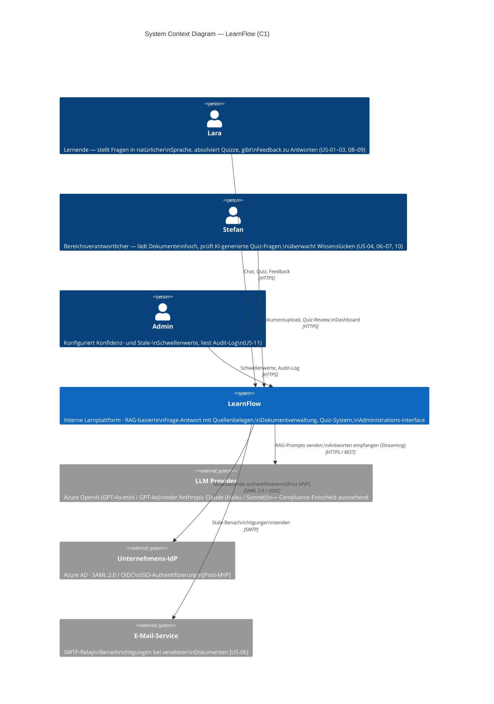

# C4 Level 1 — System Context Diagram: LearnFlow

Drei Darstellungsformate: **Mermaid** (rendert direkt in GitHub/GitLab/Notion),
**PlantUML** (präzises Layout, gängiges CI-Tool) und **Structurizr DSL**
(kanonisches C4-Format, unterstützt alle vier C4-Ebenen).

---

## Legende

| Symbol | Bedeutung |
|---|---|
| 🟦 Blau (gefüllt) | LearnFlow — das zentrale System |
| 👤 Blau (Person) | Interner Nutzer |
| ⬜ Grau | Externes System |
| → Pfeil | Interaktion / Datenfluss (Richtung: vom Aufrufenden zum Aufgerufenen) |
| `[Post-MVP]` | Noch nicht im MVP implementiert |

---

## Format 1 · Mermaid C4Context

Rendert in GitHub, GitLab, Notion, Obsidian und allen Mermaid-fähigen Tools.



---

## Format 2 · PlantUML C4

Benötigt die [C4-PlantUML-Bibliothek](https://github.com/plantuml-stdlib/C4-PlantUML).
Rendert lokal mit PlantUML-CLI oder online auf [plantuml.com](https://www.plantuml.com/plantuml).

```plantuml
@startuml LearnFlow_C1_SystemContext
!include https://raw.githubusercontent.com/plantuml-stdlib/C4-PlantUML/master/C4_Context.puml

LAYOUT_TOP_DOWN()
LAYOUT_WITH_LEGEND()

title System Context Diagram — LearnFlow (C1)

' ── Nutzer ──────────────────────────────────────────────────────────────────
Person(lara, "Lara", "Lernende\nStellt Fragen in natürlicher Sprache,\nabsolviert Quizze, gibt Feedback.\n[US-01, US-02, US-03, US-08, US-09]")

Person(stefan, "Stefan", "Bereichsverantwortlicher\nVerwaltet Wissenskorpus, prüft\nKI-generierte Quiz-Fragen,\nüberwacht Wissenslücken.\n[US-04, US-06, US-07, US-10]")

Person(admin, "Admin", "Systemadministrator\nKonfiguriert Schwellenwerte und\nliest Audit-Log.\n[US-11]")

' ── Hauptsystem ─────────────────────────────────────────────────────────────
System(learnflow, "LearnFlow", "Interne Lernplattform\n\nRAG-basierte Frage-Antwort mit\nQuellenbelegen und Konfidenz-Scoring,\nDokumentverwaltung (PDF/DOCX/MD),\nQuiz-System, Wissenslücken-Dashboard,\nAdministrations-Interface.")

' ── Externe Systeme ──────────────────────────────────────────────────────────
System_Ext(llm, "LLM Provider", "Azure OpenAI Service\n(GPT-4o-mini · GPT-4o)\noder Anthropic Claude API\n(Haiku · Sonnet)\n\nGeneriert quellenbelegte Antworten\nund Quiz-Fragen via RAG-Prompts.\n[Compliance-Entscheid ausstehend]")

System_Ext(idp, "Unternehmens-IdP", "Azure AD\nSAML 2.0 / OIDC\n\nSSO-Authentifizierung\nfür Mitarbeitende.\n[geplant für Post-MVP]")

System_Ext(mail, "E-Mail-Service", "SMTP-Relay\n\nBenachrichtigungen an Stefan\nbei veralteten Dokumenten.\n[US-06]")

' ── Beziehungen: Nutzer → System ────────────────────────────────────────────
Rel(lara,   learnflow, "Stellt Fragen, absolviert Quizze,\ngibt Feedback zu Antworten", "HTTPS")
Rel(stefan, learnflow, "Lädt Dokumente hoch, prüft\nQuiz-Fragen, liest Dashboard", "HTTPS")
Rel(admin,  learnflow, "Konfiguriert Schwellenwerte,\nliest Audit-Log", "HTTPS")

' ── Beziehungen: System → Extern ────────────────────────────────────────────
Rel(learnflow, llm,  "Sendet RAG-Prompts mit\nRetrieval-Kontext, empfängt\nAntworten (inkl. Streaming)", "HTTPS / REST")
Rel(learnflow, idp,  "Delegiert Authentifizierung\nan IdP [Post-MVP]", "SAML 2.0 / OIDC")
Rel(learnflow, mail, "Sendet Stale-Content-\nBenachrichtigungen", "SMTP")

@enduml
```

---

## Format 3 · Structurizr DSL

Kanonisches C4-Format von Simon Brown. Ermöglicht konsistente Generierung
aller vier C4-Ebenen (C1–C4) aus einem einzigen Modell.
Renderbar auf [structurizr.com](https://structurizr.com) oder lokal mit
[Structurizr Lite](https://github.com/structurizr/lite).

```dsl
workspace "LearnFlow" "Architecture workspace — LearnFlow Lernplattform" {

    model {

        !docs docs

        ' ── Nutzer ───────────────────────────────────────────────────────────
        lara = person "Lara" {
            description "Lernende (Junior Employee). Stellt Fragen in natürlicher Sprache, absolviert Quizze und gibt Feedback zu Antworten. [US-01, US-02, US-03, US-08, US-09]"
            tags "Learner"
        }

        stefan = person "Stefan" {
            description "Bereichsverantwortlicher (Knowledge Owner). Verwaltet den Wissenskorpus, prüft KI-generierte Quiz-Fragen und überwacht Wissenslücken im Dashboard. [US-04, US-06, US-07, US-10]"
            tags "AreaManager"
        }

        admin = person "Admin" {
            description "Systemadministrator. Konfiguriert Konfidenz- und Stale-Schwellenwerte über die Admin-Seite und liest das Audit-Log. [US-11]"
            tags "Admin"
        }

        ' ── Hauptsystem ──────────────────────────────────────────────────────
        learnflow = softwareSystem "LearnFlow" {
            description "Interne Lernplattform mit RAG-basierter Frage-Antwort und Konfidenz-Scoring, Dokumentverwaltung (PDF/DOCX/MD), Quiz-System, Wissenslücken-Dashboard und Administrations-Interface. Pilot: 1 Bereich, Desktop-Browser, Sprache: Deutsch."
            tags "Internal"
        }

        ' ── Externe Systeme ──────────────────────────────────────────────────
        llmProvider = softwareSystem "LLM Provider" {
            description "Azure OpenAI Service (GPT-4o-mini / GPT-4o) oder Anthropic Claude API (Haiku / Sonnet). Compliance-Entscheid (EU-Datenresidenz) ausstehend. Generiert quellenbelegte Antworten und Quiz-Fragen via RAG-Prompts."
            tags "External"
        }

        unternehmensIdP = softwareSystem "Unternehmens-IdP" {
            description "Azure AD oder kompatibler SAML 2.0 / OIDC Identity Provider. Übernimmt SSO-Authentifizierung der Mitarbeitenden. Geplant für Post-MVP."
            tags "External" "PostMVP"
        }

        emailService = softwareSystem "E-Mail-Service" {
            description "Unternehmenseigener SMTP-Relay. Sendet automatische Benachrichtigungen an Bereichsverantwortliche, wenn Dokumente den Stale-Schwellenwert überschreiten. [US-06]"
            tags "External"
        }

        ' ── Beziehungen: Nutzer → Hauptsystem ────────────────────────────────
        lara   -> learnflow "Stellt Fragen, absolviert Quizze, gibt Feedback" "HTTPS"
        stefan -> learnflow "Lädt Dokumente hoch, prüft Quiz-Fragen, liest Dashboard" "HTTPS"
        admin  -> learnflow "Konfiguriert Systemparameter, liest Audit-Log" "HTTPS"

        ' ── Beziehungen: Hauptsystem → Extern ────────────────────────────────
        learnflow -> llmProvider      "Sendet RAG-Prompts mit Retrieval-Kontext, empfängt Antworten inkl. Streaming" "HTTPS / REST"
        learnflow -> unternehmensIdP  "Delegiert SSO-Authentifizierung [Post-MVP]" "SAML 2.0 / OIDC"
        learnflow -> emailService     "Sendet Stale-Content-Benachrichtigungen" "SMTP"
    }

    views {

        systemContext learnflow "C1_SystemContext" {
            title "System Context — LearnFlow (C1)"
            include *
            autoLayout tb 400 200
            description "C4 Level 1: Zeigt alle Nutzer, das LearnFlow-System und alle externen Systeme mit ihren Beziehungen."
        }

        styles {
            element "Person" {
                shape   Person
                background "#08427B"
                color   "#ffffff"
                fontSize 14
            }
            element "Internal" {
                background "#1168BD"
                color   "#ffffff"
                shape   RoundedBox
            }
            element "External" {
                background "#6b6b6b"
                color   "#ffffff"
                shape   RoundedBox
            }
            element "PostMVP" {
                border  Dashed
            }
            relationship "Relationship" {
                thickness 2
                fontSize  12
            }
        }

        theme default
    }
}
```

---

## Format-Vergleich

| | Mermaid | PlantUML | Structurizr DSL |
|---|---|---|---|
| **Rendering** | GitHub/GitLab/Notion/Obsidian | CLI / plantuml.com | structurizr.com / Lite |
| **Layout-Kontrolle** | Automatisch (eingeschränkt) | Gut steuerbar | Automatisch / manuell |
| **C4-Unterstützung** | C1–C3 | C1–C4 (via Library) | C1–C4 nativ |
| **Versionierbar** | ✓ (Text) | ✓ (Text) | ✓ (Text) |
| **Empfehlung** | Schnelle Darstellung in Docs | Präzises Diagramm für Export | Konsistentes C1–C4 Modell |
```
